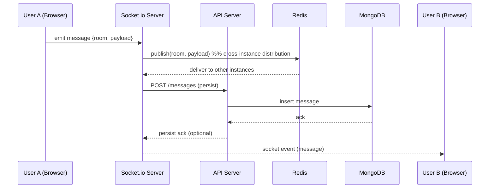
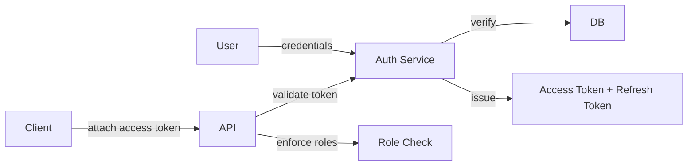
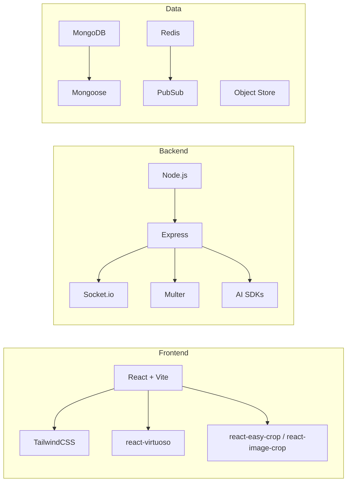

# JustUs V2

High-level, production-oriented README redesigned with Google SRE/SWE best practices in mind. This document emphasizes clarity, operational readiness, and developer onboarding: architecture, runbook, observability, security, testing, and contribution workflow.

---

## Overview

JustUs V2 is a real-time, full-stack chat application built on the MERN stack. It focuses on low-latency messaging, media support, PWA capabilities, and optionally integrated AI services (Google Generative AI / OpenAI) for smart features like translation and assistant replies.

Goals:
- Scalable real-time messaging with partitioned rooms and horizontal backend scaling
- Secure user auth with JWT + refresh tokens and hardened endpoints
- Observable: structured logs, metrics, and traces
- Testable: unit, integration, and end-to-end tests with CI gating

---

## Highlights / Quick Start

- Languages: JavaScript / TypeScript (where applicable)
- Primary frameworks: React (Vite), Express, MongoDB (Mongoose), Socket.io
- Local dev: start backend + frontend concurrently (npm start)
- PWA-ready and optimized for mobile

Quick commands
```
# clone
git clone https://github.com/BhashkarKumar2/JustUs.git
cd JustUs

# install all (root script runs installs in frontend & backend)
npm run install-all

# start dev servers
npm start

# run backend only
npm run server

# run frontend only (from /frontend)
npm run client
```

---

## Architecture — System View

```mermaid
graph TB
  subgraph ClientLayer
    C[User Client<br/>React (Vite), PWA]
  end

  subgraph EdgeLayer
    CDN[CDN / Static Hosting]
    LB[Load Balancer]
  end

  subgraph AppLayer
    FE[Frontend Server (static)]
    API[API Layer<br/>Express + Node.js]
    SIO[Socket.io Server]
    AI[AI Services (Google / OpenAI)]
  end

  subgraph DataLayer
    DB[MongoDB Replica Set]
    Cache[Redis (pub/sub, sessions)]
    ObjectStore[S3-compatible storage]
  end

  C -->|HTTP / WebSocket| CDN
  CDN --> FE
  CDN --> LB
  LB --> API
  LB --> SIO
  API --> DB
  API --> Cache
  API --> ObjectStore
  SIO --> Cache
  SIO --> API
  API --> AI
```

Explanation
- CDN serves the frontend build (fast edge delivery).
- Load balancer routes REST and WebSocket traffic to horizontally scaled instances.
- Socket.io servers coordinate via Redis pub/sub for cross-instance room broadcasts.
- MongoDB stores messages, metadata, and user profiles; object store holds media.
- AI calls are asynchronous and rate-limited; sensitive data is redacted before sending.

Trade-offs
- Use Redis for cross-process pub/sub to keep Socket.io horizontally scalable.
- Persist messages to MongoDB synchronously (consistent) while media uploads go to object store (eventual consistency for large files).

---

## Message Flow — Real-time Communication



Notes
- Clients optimistically render messages; server writes confirm and reconcile (use message IDs/timestamps).
- Backpressure: validate and rate-limit at socket and API layers.

---

## Authentication & Authorization



Auth Design
- Passwords hashed with bcrypt (or Argon2 where available).
- Access token: short-lived JWT (e.g., 5–15 minutes).
- Refresh token: stored in DB (or Redis) and rotated on use.
- Socket.io uses the initial access token during handshake; token refresh handled via REST and a reconnection strategy.

Security considerations
- Rate-limit login endpoints
- Enforce TLS everywhere
- Sanitize user input (prevent NoSQL injection)
- Use CSP and secure headers (helmet)
- Apply Content Security and CORS strictness

---

## Feature Integration Map

```mermaid
graph TB
  Core[JustUs Core - Real-time Chat]
  Core --> RT[Socket.io - Rooms]
  Core --> AUTH[Auth - JWT / Sessions]
  Core --> MEDIA[Media Upload - Multer -> ObjectStore]
  Core --> AI[AI - Assist & Translate (opt-in)]
  Core --> PWA[PWA - Offline Support / Caching]
  Core --> PERF[Caching / Virtualization - Redis / react-virtuoso]
```

Per-feature notes
- Media: validate MIME types, virus scan, store in object storage; serve signed URLs.
- AI: treat as downstream service; queue heavy requests and fail gracefully.
- PWA: provide fallbacks for offline message composition and sync on reconnect.

---

## Technology Breakdown



Why these choices
- Vite + React for fast dev iteration and optimized builds.
- Socket.io for reliable bi-directional events and established ecosystem.
- Redis for cross-process coordination and ephemeral session storage.
- MongoDB for flexible message schemas and easy horizontal scaling.

---

## Local Development — Detailed

1. Copy example env
```
cp backend/.env.example backend/.env
# Populate required vars: MONGO_URI, JWT_SECRET, REDIS_URL, S3_* keys, AI_API_KEY (optional)
```

2. Install
```
npm run install-all
```

3. Run (development)
```
npm start
# or run components separately
npm run server   # starts backend on :5000
npm run client   # starts frontend on :5173
```

4. Useful endpoints
- Backend health: GET /health
- Metrics (dev/expose): GET /metrics (Prometheus format)
- API docs (if present): GET /api/docs

---

## Environment variables (minimum)

backend/.env
- MONGO_URI=
- JWT_SECRET=
- JWT_REFRESH_SECRET=
- REDIS_URL=
- S3_BUCKET=
- S3_REGION=
- S3_ACCESS_KEY_ID=
- S3_SECRET_ACCESS_KEY=
- AI_API_KEY= (optional)
- NODE_ENV=development

Frontend .env (Vite)
- VITE_API_BASE_URL=
- VITE_SOCKET_URL=

---

## Testing & Quality

- Unit tests: run in each package (frontend/backend)
- Integration tests: exercise API + DB (use ephemeral docker-compose or test containers)
- E2E: Cypress / Playwright for critical flows (auth, send/receive, media)
- Linting: ESLint + Prettier with pre-commit hooks
- Coverage: threshold enforced in CI

Suggested commands
```
# run all tests
npm test

# run linter
npm run lint

# run e2e
npm run e2e
```

---

## CI / CD (recommended)

CI jobs:
- install
- lint
- unit tests
- integration tests (using test database)
- build (frontend)
- e2e (optional for protected branches)
- publish artifacts (frontend build to CDN, backend Docker image)

CD:
- Deploy backend containers behind LB (GKE / Cloud Run / GCE)
- Serve frontend via CDN (Cloud Storage + CDN or Netlify/Vercel)
- Use tagging and canary rollouts for production

---

## Observability & Runbook

Logging
- Structured JSON logs (severity, trace_id, request_id)
- Redact PII before logging

Metrics
- Request rates, errors, latency, socket connections per instance
- Message persistence/failure rates

Tracing
- Propagate trace IDs across websocket and REST calls (OpenTelemetry)

Runbook (examples)
- “High latency” — check DB CPU, Redis latency, socket backlog
- “WebSocket disconnect storms” — check instance restarts and sticky sessions / LB config
- “Failed message persistence” — check DB, disk I/O, and API error logs

---

## Security and Privacy

- Encrypt secrets and keys (KMS)
- Rotate keys periodically
- Minimal privilege for service accounts (object store, DB users)
- Store refresh tokens server-side and support revocation
- Data retention policy: purge logs & messages per config/region law
- GDPR/CCPA considerations for user data

---

## Contribution Guide (SDE-style)

1. Fork -> branch named feat/short-description or fix/issue-number
2. Implement tests for new behavior
3. Run lint and tests locally
4. Open PR with clear description, motivation, and screenshots if UI-related
5. Assign reviewers, include relevant issue number, link design docs for large changes
6. CI must pass before merging; prefer squash merges with a descriptive commit message

Commit style
- feat: add new feature
- fix: bug fix
- docs: documentation changes
- perf: performance improvement
- test: tests and tooling
- chore: maintenance

---

## Roadmap (short)

- Improve horizontal scaling of Socket.io (k8s + autoscaling)
- Add per-room moderation tools and abuse detection
- Add offline message sync and conflict resolution
- Better mobile push notification integration
- Expand AI features with privacy-preserving techniques

---

## License

ISC (see LICENSE)

---

## Contact / Maintainers

- Primary: repository owner (GitHub profile)
- For production incidents: open an issue with label `incident` and follow runbook.

---

Thank you — this README is structured to be both developer-friendly and operations-ready. Tell me which parts you'd like me to expand into separate docs (e.g., security runbook, deployment playbook, API reference) and I'll generate those next.