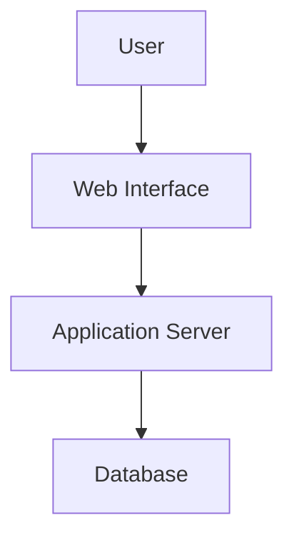
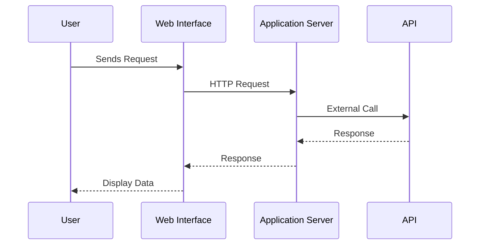
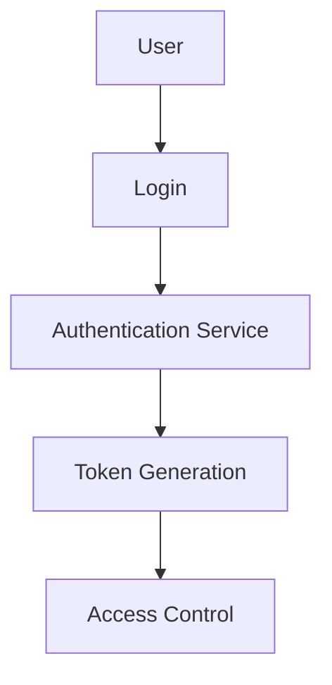
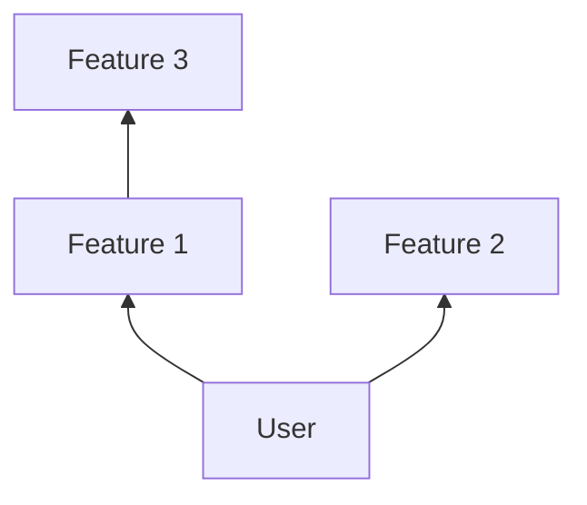
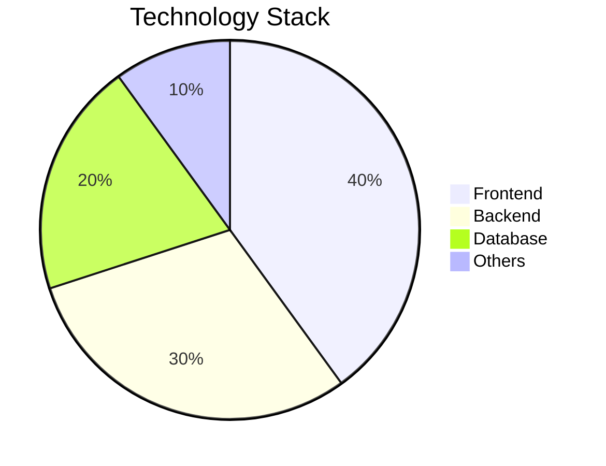
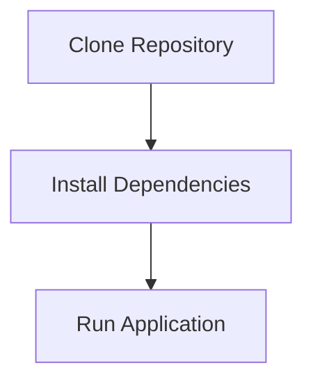

# JustUs V2

## Mermaid Diagrams

### System Architecture

### Real-time Communication Flow

### Authentication & Security Flow

### Feature Integration Map

### Technology Stack Breakdown

### Installation & Setup Flow

## Features
   - Real-time messaging
   - User authentication
   - Media sharing

## Tech Stack
   - React.js
   - Node.js
   - MongoDB

## Prerequisites
   - Node.js installed
   - MongoDB running locally

## Installation
   1. Clone the repository
   2. Install dependencies using `npm install`
   3. Start the application using `npm start`

## Running the Application
   - Open your browser and navigate to `http://localhost:3000`

## Contributing
   - Open a pull request with your changes

## License
   - MIT License